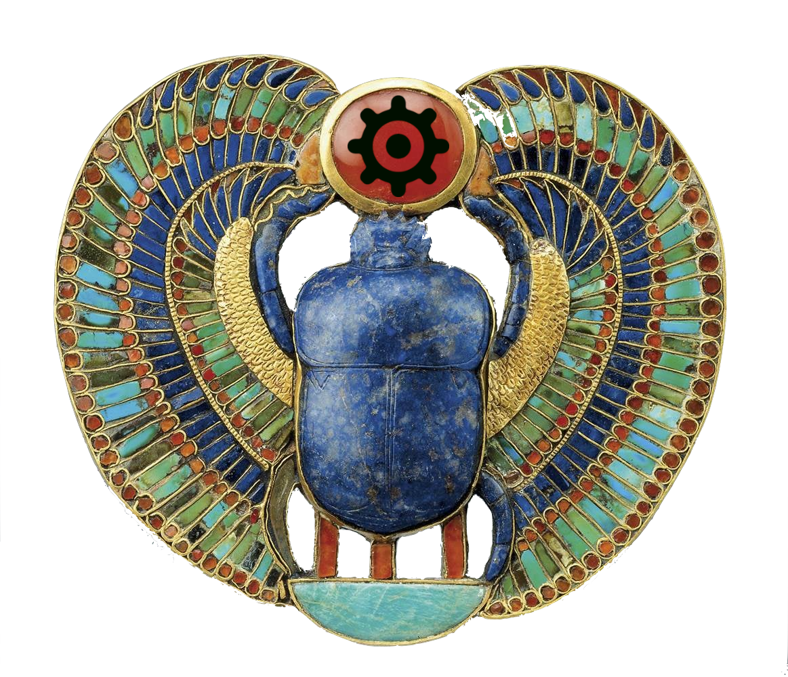

# King Tutte Datamap Codex

This repos is a Jupyter Book (v2) full of datamapping notebooks design
to run on [Google's Colab](https://colab.research.google.com/) Jupyter
service.

  
  
Tut's <a href="https://en.wikipedia.org/wiki/Pectoral_(Ancient_Egypt)">pectoral amulet</a>

This repo can stand alone by itself but it is also used as a part of
[the King Tutte
Scrolls](https://github.com/Connoiter/king_tutte_scrolls). The Scrolls
is an Agent Skill, as defined by Anthropic. This Codex is included as
a submodule in the Scrolls. The two together make up a datamap SDK,
with the core (UMAP, HDBSCAN, Toponomy, EVōC, DataMapPlot, etc.) being
technology out of the Tutte Institute, including most of the
notebooks.

Note this project and its lighthearted tone are the product of
[Connoiter](https://connoiter.com). The Tutte Institute had nothing
to do with the Codex (except do all the hard work). The main value
of this project is to gather various notebooks together and make
them all run on Colab out of the box. This Codex was developed for
use during conference workshops but also serves well for self-study 
of making datamaps.

## Etymology

The Scrolls project started before the Codex. Actually the latter was
forked out of the former.

The name, Scrolls, being plural implies multiple separate scrolls
because the project is essentially just an agglomeration of multiple
separate repos (each a scroll in this metaphor) into one unit which
can be packaged as an Agent Skill.

The Codex is a Jupyter Book ergo the name, Codex. (A codex is an
ancient type of book wherein individual sheets of paper are bound on
one side, as distinct from modern books which might have signatures,
pages folded in half and then bound to seem like two pages, etc.). Both
scrolls and codices could be made of papyrus.

"A book in a collection of scrolls? Wha?" If really necessary then the
metaphor could be tortured by saying a codex can be unbound and then
the pages rebound as a scroll. Actually, in the case of the Scrolls
the Jupyter notebooks (*.ipynb files) are repurposed into markdown
files (the default file type of Agent Skills. So take that, you pedants :P

